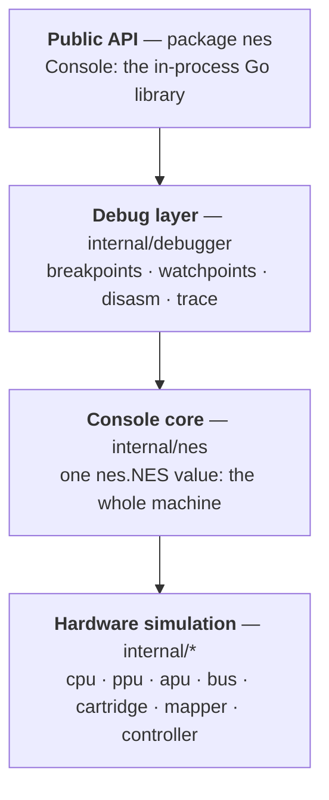

# Architecture

Each arrow is "depends on and wraps": the public API is the outermost
layer and the hardware simulation the innermost, and nothing points back
outward.

Everything emulated lives in one internal `nes.NES` value, with no globals
and no hidden state. The public `nes` package wraps it as `Console`, a
direct Go library, and each `Console` is one independent emulator instance.
It is not safe for concurrent use; drive each one from a single goroutine.

The core knows nothing about presentation, orchestration or transport.
Consumers embed `Console` directly: a desktop frontend, a WebAssembly page
that calls the Go API through `syscall/js`, a test harness, or a debugger
built on top of the observation and control primitives below. None of them
cross a wire to reach the core; they link against it.

## Observation and control

`Console` exposes enough to build a full external debugger without the core
knowing that debugger exists. Three groups of primitives:

- Execution and inspection: `Step`, `RunFrame`, `Reset`, `State` (CPU
  registers plus the PPU raster position), `Peek`/`ReadMem`, `Disasm`, and
  the built-in `internal/debugger` breakpoints, watchpoints and trace.
- Mutation: `Poke`, `SetRegister`, `SetOAM`, `SetPaletteRAM`, live ROM and
  mapper patching, and whole-console `SaveState`/`LoadState`.
- Bus taps: `SetObserver` installs an `Observer` that sees every CPU-bus
  read and write as it happens (inside `Step`), and `SetMemFilter` installs
  a `MemFilter` that can substitute the value a read returns (a Game Genie
  code) or replace or block a write (a value lock). Both are optional and
  nil by default, so a console with no debugger attached pays one nil check
  per bus access and nothing else.

These live in the `bus.Hooks` fields the fabric checks on each access
(`internal/bus`) and are surfaced on the public `Console` as the `Observer`
and `MemFilter` interfaces. An out-of-core debugger consumes exactly this
surface: memory breakpoints and access views come from the `Observer`,
cheats and freezes from the `MemFilter`, and execute breakpoints from
driving `Step` and watching the program counter. Because the debugger owns
its run loop and only reads the public API, it can live in a separate module
entirely.

## Timing

Everything advances from inside the CPU's bus cycles on one shared master
clock (21.477272 MHz on NTSC, 26.601712 MHz on PAL and Dendy). Each read
or write runs the PPU to the exact sub-cycle position of the access (a
read lands at +5 master ticks and a write at +7 on NTSC), then clocks the
board and the APU. The PPU renders per dot, background fetches take their
real two-cycle ALE/data shape on a modeled address bus, and DMA is
cycle-exact, including OAM and DMC and the collisions and aborts between
them.

The TV system is one small set of parameters resolved once when the
console powers on (or when the region is overridden): the CPU and PPU
master-clock dividers, the number of scanlines, the vblank/NMI line, the
odd-frame dot skip, and the APU's rate tables. Each unit copies the
scalars it needs into fields, so no per-cycle code branches on the region;
NTSC stays byte-for-byte what it was.

None of that is a claim on faith. AccuracyCoin passes 141/141, nestest
matches the canonical log line by line, and blargg's CPU, PPU, APU, OAM and
MMC3 suites pass, all held in place by the test suite as regression floors.

## Determinism

State is built for determinism. Every chip keeps its mutable state in a
plain, value-copyable `State` struct, and `nes.Snapshot` is the whole
console as a single value, so in-process save and restore are just struct
assignments with no allocation (a test enforces that).

For save states, each `State` has a hand-written field-by-field binary
codec in `internal/serial`, so `SaveState` returns a self-contained blob
and `LoadState` restores it deterministically. A round-trip test runs the
console 200k steps and compares every field, which catches a codec that
ever drops one. The usual reflection encoders (gob, `binary.Write`) won't
work here, because the `State` structs carry load-bearing unexported
fields that those encoders quietly skip.
