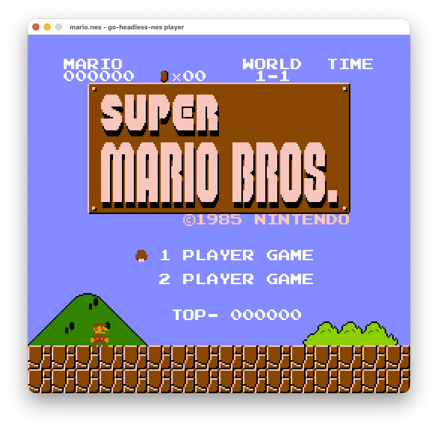

# Desktop example

The go-headless-nes core in a native window, built on
[Ebitengine](https://ebitengine.org). The core emulates and converts the
output; this program only opens a window, moves each frame to the screen,
plays the audio, and reads the keyboard.



It is its own Go module, so the Ebitengine dependency never touches the
core's `go.mod`.

## Run

```bash
cd examples/nes
go run . path/to/game.nes
```

## Controls

| Key | Button |
| --- | --- |
| Arrows | D-pad |
| Z | B |
| X | A |
| Enter | Start |
| Right Shift | Select |
| R | Reset |
| F5 | Save state |
| F9 | Load state |
| 1 / 2 / 3 | force NTSC / PAL / Dendy |
| 0 | auto (re-detect from the header) |

The window title shows the region in effect. A game whose header wrongly
claims NTSC runs about 20% fast until you press `2`.

## How it works

One Ebitengine tick runs one emulated frame. The tick rate follows the
console's frame rate (`FrameRate`), so it is 60 on NTSC and 50 on PAL and
Dendy rather than a fixed 60, which is what keeps PAL games at true speed.
`VideoRGBA` turns the framebuffer into an RGBA texture through the core's
palette, and `AudioStream` buffers the samples and feeds them to the sound
card as 16-bit stereo PCM at `SampleRate`. What is left here is the
Ebitengine glue: the window, the keyboard, and the two devices.
